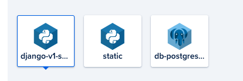
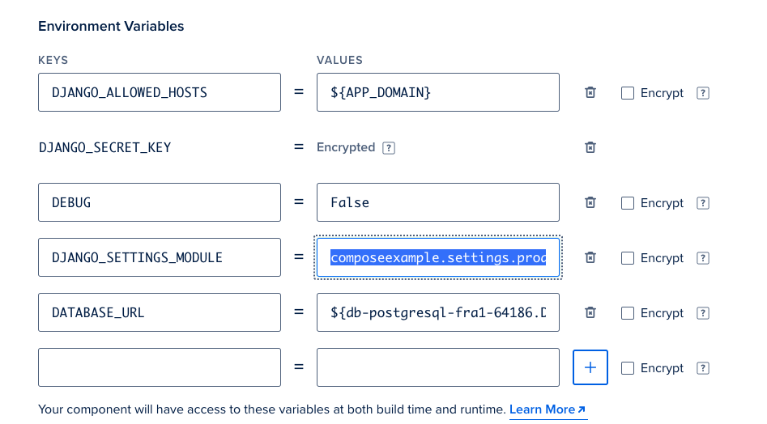
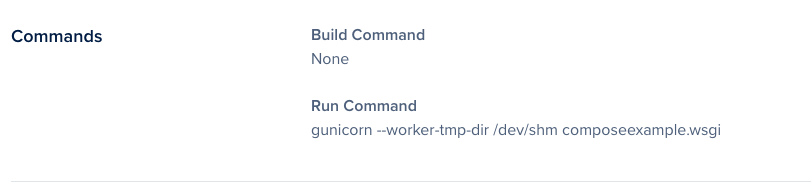
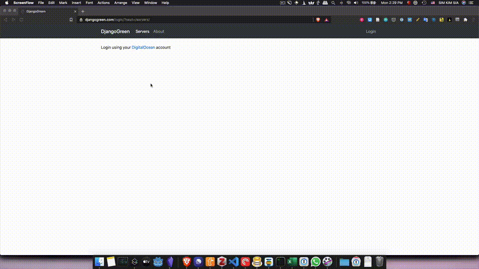
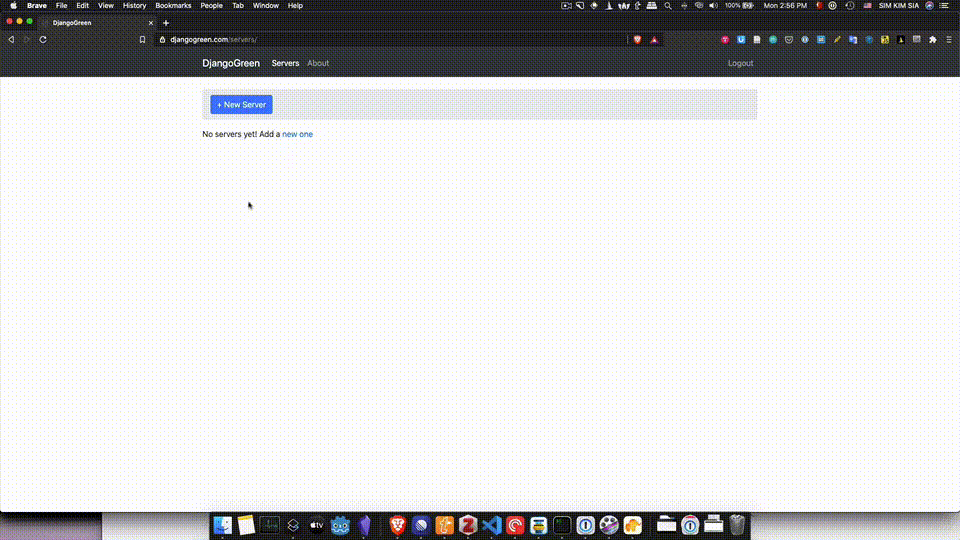
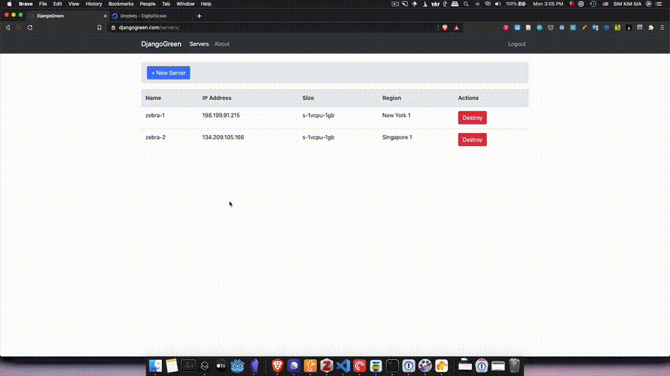

# django-green

DO App Platform is not fully fledged with deploying from a button when you have complicated setup. So I won't have one. To avoid confusion.

There will be 3 components, a webservice that is the main component, a static, and a database.

The following env variables are for the main webservice component that runs the django code

The `DJANGO_SETTINGS_MODULE` env is `composeexample.settings.production`

The run command is `gunicorn --worker-tmp-dir /dev/shm composeexample.wsgi`

## Components

## Env Variables for the main components

## Commands

## How the app looks like

**Login and create new account using DigitalOcean**

**Create new droplets easily with just a single click**

**Destroy droplets just as easily with a single click and a confirm dialog**